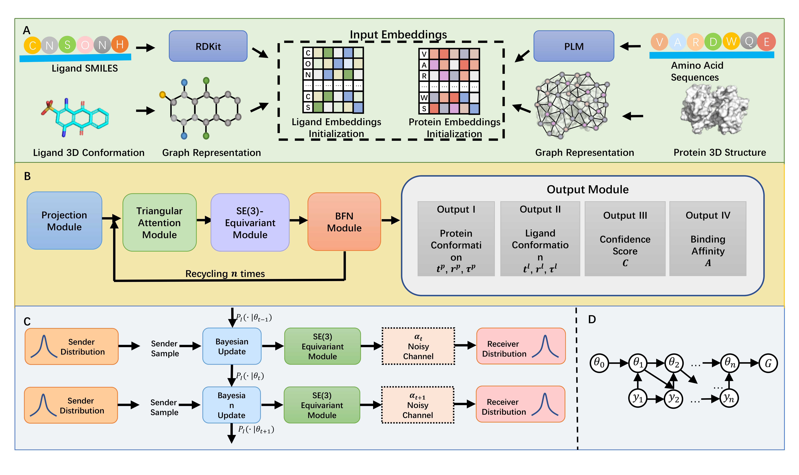

# FlowDock
Source code for the paper [FlowDock: A Unified Flow-Based Framework for Flexible Protein-Ligand Docking and Binding Affinity Prediction].

FlowDock provides the users with a powerful flexible blind docking method to study protein-ligand interactions which outputs ranked binding poses with the corresponding binding affinity and a confidence score. 


# Setup Environment

Create a new environment for inference. While in the project directory run 

    conda env create -f environment.yml

Or you setup step by step:

    conda create -n flowdock python=3.10

Activate the environment

    conda activate flowdock

Install
    
    conda install pytorch torchvision torchaudio pytorch-cuda=11.8 -c pytorch -c nvidia
    conda install -c conda-forge rdkit
    conda install pyg  pyyaml  biopython -c pyg
    pip install pyg_lib torch_scatter torch_sparse torch_cluster torch_spline_conv -f https://data.pyg.org/whl/torch-2.0.0+cu118.html
    pip install e3nn  fair-esm spyrmsd

Install

    conda install -c conda-forge openmm pdbfixer libstdcxx-ng openmmforcefields openff-toolkit ambertools=22 compilers biopython

# Dataset
We have preprocessed the dataset as described in the article. The data upon request at the corresponding authors email. 
# Inference

## Docking
By default: 40 poses will be predicted, poses will be ranked (rank1 is the best-scoring pose, rank40 the lowest).

#### Inputs:
1. **Protein (PDB File):** `protein.pdb` 
   - Automatically cleaned to remove non-standard amino acids, water molecules, or small molecules.
2. **Ligand (CSV File):** `ligand.csv` 
   - Must contain a column named 'ligand' listing smiles.
3. **Number of Animations:** 
   - outputs intermediate pkl data, not the final animation PDB. (After `--savings_per_complex`, default is 40)


#### Additional Options:
- `--header`: Name of the result folder.
- `--device`: GPU device ID.
- `--python`: Python environment for inference.
- `--num_workers`: Number of processes for final output relaxation.

#### Example Command:
```bash
python run_single_protein_inference.py protein.pdb ligand.csv --savings_per_complex 40 --inference_steps 20 --header test --device $1 --python /home/user/anaconda3/envs/flowdock/bin/python --relax_python /home/user/anaconda3/envs/relax/bin/python
```


### Docking Outputs
The results of the docking step, typically found in the `results/test` folder, include:

1. **Affinity Score for Each Complex**: `affinity_prediction.csv`
2. **Pose Score and Conformation of Each Animation**: Example files like `rank1_ligand_lddt0.63_affinity5.67_relaxed.sdf` (where 0.63 is the pose score) and corresponding protein `.pdb` files.


